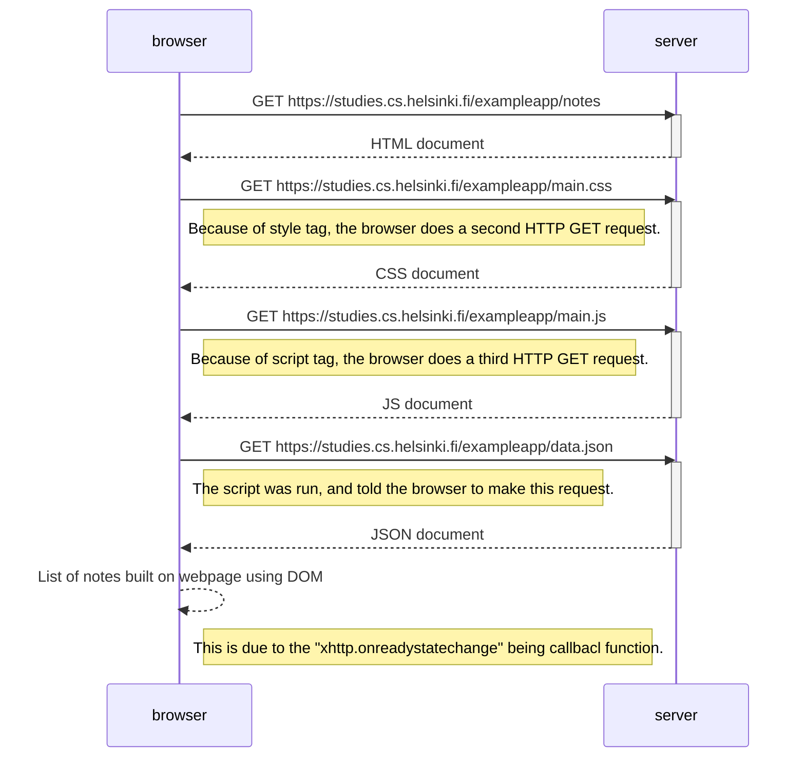
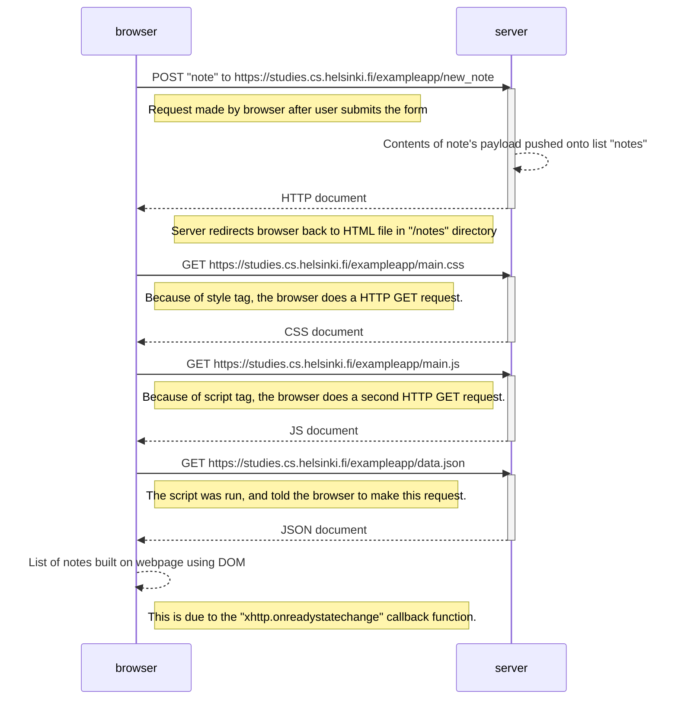

# Initial page setup

```mermaid
sequenceDiagram
    participant browser
    participant server

    browser->>server: GET https://studies.cs.helsinki.fi/exampleapp/notes
    activate server
    server-->>browser: HTML document
    deactivate server

    browser->>server: GET https://studies.cs.helsinki.fi/exampleapp/main.css
    activate server
    Note right of browser: Because of style tag, the browser does a second HTTP GET request.
    server-->>browser: CSS document
    deactivate server

    browser->>server: GET https://studies.cs.helsinki.fi/exampleapp/main.js
    activate server
    Note right of browser: Because of script tag, the browser does a third HTTP GET request.
    server-->>browser: JS document
    deactivate server

    browser->>server: GET https://studies.cs.helsinki.fi/exampleapp/data.json
    activate server
    Note right of browser: The script was run, and told the browser to make this request.
    server-->>browser: JSON document
    deactivate server
    browser-->>browser: List of notes built on webpage using DOM
    Note right of browser: This is due to the "xhttp.onreadystatechange" being callbacl function.
```
# Form submitted

```mermaid
sequenceDiagram
    participant browser
    participant server

   browser->>server: POST "note" to https://studies.cs.helsinki.fi/exampleapp/new_note
   activate server
   Note right of browser: Request made by browser after user submits the form
   server-->>server: Contents of note's payload pushed onto list "notes"
   server-->>browser: HTTP document
   deactivate server
   Note left of server: Server redirects browser back to HTML file in "/notes" directory

   browser->>server: GET https://studies.cs.helsinki.fi/exampleapp/main.css
    activate server
    Note right of browser: Because of style tag, the browser does a HTTP GET request.
    server-->>browser: CSS document
    deactivate server

    browser->>server: GET https://studies.cs.helsinki.fi/exampleapp/main.js
    activate server
    Note right of browser: Because of script tag, the browser does a second HTTP GET request.
    server-->>browser: JS document
    deactivate server

    browser->>server: GET https://studies.cs.helsinki.fi/exampleapp/data.json
    activate server
    Note right of browser: The script was run, and told the browser to make this request.
    server-->>browser: JSON document
    deactivate server
    browser-->>browser: List of notes built on webpage using DOM
    Note right of browser: This is due to the "xhttp.onreadystatechange" callback function.
```