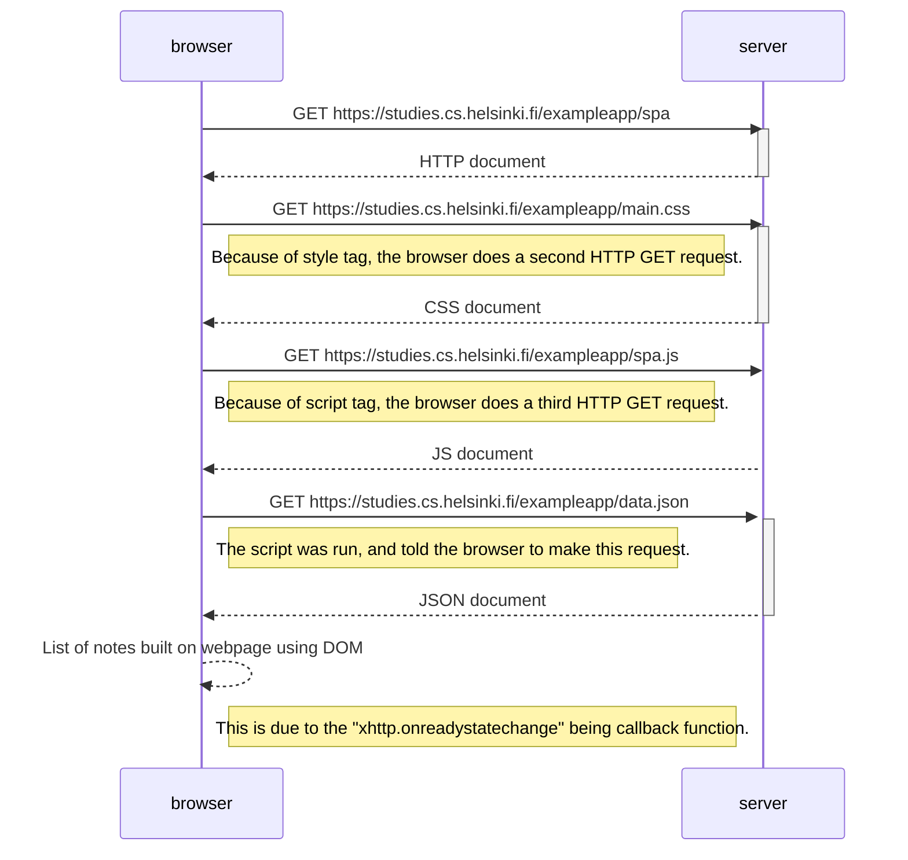

# Initial page setup (SPA)

```mermaid
sequenceDiagram
    participant browser
    participant server

    browser->>server: GET https://studies.cs.helsinki.fi/exampleapp/spa
    activate server
    server-->>browser: HTTP document
    deactivate server
    browser->>server: GET https://studies.cs.helsinki.fi/exampleapp/main.css
    activate server
    Note right of browser: Because of style tag, the browser does a second HTTP GET request.
    server-->>browser: CSS document
    deactivate server
    browser->>server: GET https://studies.cs.helsinki.fi/exampleapp/spa.js
    activate server
    Note right of browser: Because of script tag, the browser does a third HTTP GET request.
    server-->>browser: JS document
    browser->>server: GET https://studies.cs.helsinki.fi/exampleapp/data.json
    activate server
    Note right of browser: The script was run, and told the browser to make this request.
    server-->>browser: JSON document
    deactivate server
    browser-->>browser: List of notes built on webpage using DOM
    Note right of browser: This is due to the "xhttp.onreadystatechange" being callback function.
```
