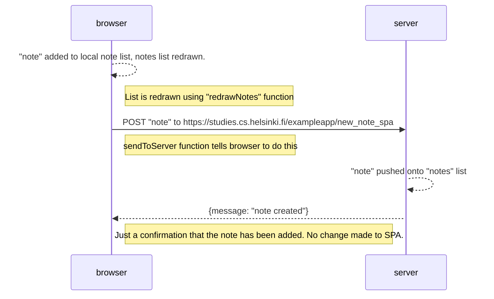

# Form submitted (SPA)

```mermaid
sequenceDiagram
    participant browser
    participant server

    browser-->>browser: "note" added to local note list, notes list redrawn.
    Note right of browser: List is redrawn using "redrawNotes" function
    browser->>server: POST "note" to https://studies.cs.helsinki.fi/exampleapp/new_note_spa
    Note right of browser: sendToServer function tells browser to do this
    activate server
    server-->>server: "note" pushed onto "notes" list
    server-->>browser: {message: "note created"}
    Note left of server: Just a confirmation that the note has been added. No change made to SPA.
```